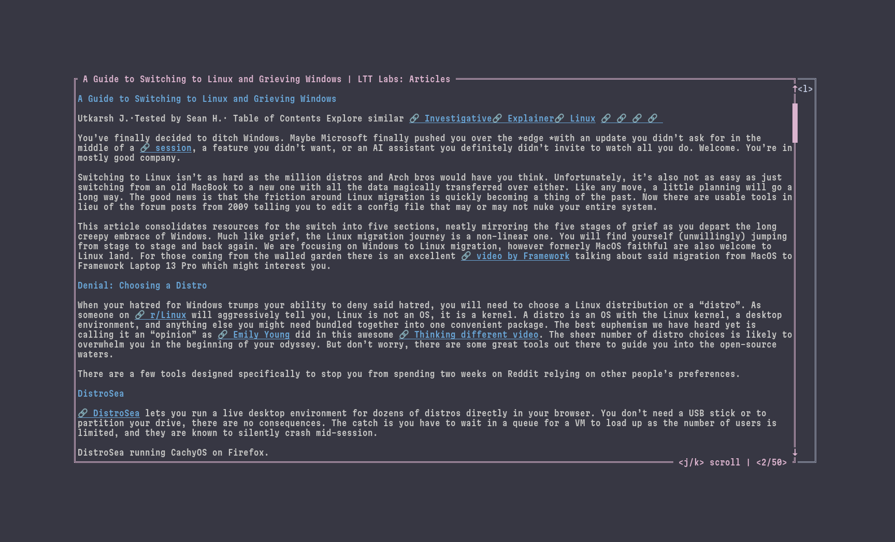

# rsstig



*rsstig* is an unconventional RSS/Atom reader for the terminal, built to solve my frustrations with existing readers. \
Its name is derived from (and pronounced the same as) 'rustig', the Afrikaans word meaning 'calm' or 'quiet'.

Instead of the typical RSS reader layout of a sidebar on the left with folders of feeds and a main panel where you scroll through articles, *rsstig* takes a different approach inspired by Steam's discovery queue. You advance through new articles with the `l` key (Vim right keybind). If a given article piques your interest, pressing `j` will download the full webpage and show it in the terminal. From there, you can scroll with `j` and `k`.

## Installation

### with Nix

Add *rsstig* to your flake inputs...

```nix
{
  inputs = {
    # ...
    rsstig = {
      url = "github:indium114/rsstig";
      inputs.nixpkgs.follows = "nixpkgs";
    };
  };
}
```

...and pass it to your `environment.systemPackages`

```nix
{
  inputs,
  pkgs,
  ...
}:

{
  environment.systemPackages = [
    inputs.rsstig.${pkgs.stdenv.hostPlatform.system}.rsstig
  ];
}
```

### from the Binary

Go to the *Releases* section on the right, click the latest release, and click the binary for your architecture to download it.

> [!note]
> On macOS, you will have to compile `rsstig` from source.

### with [wares](https://github.com/indium114/wares)

Simply add the following to your `config.yaml`:

```yaml
wares:
  rsstig:
    name: rsstig
    repo: indium114/rsstig
    asset: "rsstig_Linux_x86_64"
```
> replace `x86_64` with `arm64` if you're on an ARM processor.

### with cargo

Run the following to install *rsstig*. Ensure that `~/.cargo/bin` is in your `$PATH`

```shell
cargo install rsstig
```

## Usage

### Adding feeds

Feeds are stored in `~/.config/rsstig/feeds.opml`. You can manually write this file, or export it from your current RSS reader.

> [!note]
> If you export from another RSS reader, you will need to do some manual tweaking to the file to remove any folder/grouping structure.

Here's an example with the *LTT Labs* feed from earlier, as well as the Rust Blog:

```xml
<?xml version='1.0' encoding='UTF-8' ?>
<opml version="1.0">
    <body>
        <outline
            text="LTT Labs: Articles"
            description="Welcome to LTT Labs - your go-to destination for all things tech. Explore comprehensive test results, insightful commentary, and the latest analysis in hardware."
            xmlUrl="https://www.lttlabs.com/articles/rss.xml"
            type="rss"
        />
        <outline
            text="Rust Blog"
            description="Empowering everyone to build reliable and efficient software."
            xmlUrl="https://blog.rust-lang.org/feed.xml"
            type="rss"
        />
    </body>
</opml>
```

I took this approach because I wanted to be able to have all of my feeds in a single file managed with home-manager.

## Inspirations

- [bulletty](https://github.com/crocidb/bulletty)
- [eilmeldung](https://github.com/christo-auer/eilmeldung)
